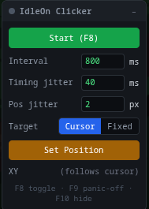

# IdleOn userscripts — autoclicker and minigame helpers

Tampermonkey userscripts for the browser version of **Legends of IdleOn**: an autoclicker, and minigame helper overlays that show you where a shot, cast or dart is going to land.

- **[IdleOn Helper Suite](#idleon-helper-suite)** — all four in one install, each individually switchable. **Start here.**
- **[IdleOn Clicker](#idleon-clicker)** — a stealthy autoclicker panel.
- **[Hoops Helper](#hoops-helper)** — a dotted-line shot preview for the Swishy Hoops minigame.
- **[Fishing Helper](#fishing-helper)** — a landing-spot aim marker for the fishing minigame.
- **[Darts Helper](#darts-helper)** — an aim path and hit-band readout for Throwy Darts.

The three minigame helpers **only draw**. They never click, move the mouse, or send input to the game.

They were built by measuring real gameplay footage: sprite colours, sizes and physics were read off recordings frame by frame rather than guessed, and the tracking and prediction code is replayed against that footage as a test.

# IdleOn Helper Suite

**[`idleon-suite.user.js`](idleon-suite.user.js)** is the clicker and all three minigame helpers in a single userscript, with a **Suite** panel that switches each one on and off.

Install it *instead of* the four scripts below, not alongside them — two copies of a helper means two panels and two overlays.

**[Install idleon-suite.user.js](https://raw.githubusercontent.com/averagenative/idleon-userscripts/main/idleon-suite.user.js)** (same steps as [below](#install): open the raw link, Tampermonkey offers to install it.)

Everything else on this page still applies — the panels, hotkeys, overlays and tuning are the same, and each helper keeps its own settings key (`ac_cfg`, `hoops_cfg`, `fish_cfg`, `darts_cfg`), so calibration learned by the standalone scripts carries straight over.

What the merge adds:

- **Unticking a helper stops it completely** — no panel, no pixel readback, no hotkey. The setting sticks across reloads.
- **One animation frame drives all of them**, and the downscaled read of the game canvas is taken **once per frame and shared** instead of once per helper. Running all three minigame helpers together now costs about what one used to.
- **Panel positions are remembered.** With five panels on screen that matters.
- **Hide all panels** in one click, an eye per row to show or hide just one, and **Reset panel layout** to put everything back in its default slot, unhidden — the way out of "my darts panel is somewhere off screen and I can't find the dot".
- **Panels can't strand themselves.** Saved positions and default slots are both clamped to the window, so a panel is never born, or restored, somewhere you can't drag it back from.
- A helper that throws no longer dies silently: the error is caught, reported in that helper's own status line, and the others keep running.

The suite is generated from the four standalone scripts rather than being a fork of them — the detection, physics and drawing code is the same code, so a fix in one lands in the other.

# IdleOn Clicker

A stealthy in-page autoclicker panel for [Legends of IdleOn](https://www.legendsofidleon.com/) (browser version), delivered as a [Tampermonkey](https://www.tampermonkey.net/) userscript.



It renders a small draggable control panel over the game and fires synthetic mouse clicks on a timer — useful for anything in IdleOn that wants repeated clicking (mining/fishing swing timers, afk-gain nudging, etc.). The panel lives in a **closed shadow DOM**, so the page's own JavaScript can't see it. The game doesn't check `isTrusted` on click events, so dispatched clicks are accepted as real.

> ⚠️ Automating input may violate the game's terms of service. Use at your own risk — this is a personal tool.

## Install

1. Install the **Tampermonkey** browser extension:
   - [Chrome / Edge / Brave](https://chromewebstore.google.com/detail/tampermonkey/dhdgffkkebhmkfjojejmpbldmpobfkfo)
   - [Firefox](https://addons.mozilla.org/firefox/addon/tampermonkey/)
2. Open the raw script:
   **[idleon-clicker.user.js](https://raw.githubusercontent.com/averagenative/idleon-userscripts/main/idleon-clicker.user.js)**
3. Tampermonkey detects the `.user.js` and opens its install tab — click **Install**.
4. Go to <https://www.legendsofidleon.com/> and load the game. The panel appears in the top-right.

### Updating

Every script declares `@updateURL`, so Tampermonkey polls this repo on its own — but only on its update interval, which defaults to **once a day**. To pull a change immediately, do any of:

- **Open the raw link again.** Tampermonkey intercepts the `.user.js`, shows you a diff, and offers **Update**. Instant, and works no matter how the script was installed.
- **Dashboard → Installed Userscripts → click the "Last updated" timestamp** for that script. That checks just that one.
- **Dashboard → Settings → Config mode: Advanced → Externals/Update → check interval**, to make automatic checks more frequent.

Two things that look like a broken update but aren't: `raw.githubusercontent.com` is CDN-cached for about five minutes, so a change pushed a moment ago may not be visible yet; and Tampermonkey only updates when `@version` **increases**, which is why the build refuses to ship suite content without bumping it.

### Manual install (alternative)

Open the Tampermonkey dashboard → **+** (Create a new script) → paste the contents of [`idleon-clicker.user.js`](idleon-clicker.user.js) → **File → Save**.

## Usage

The panel shows a status dot (green = running) and these controls:

| Control | What it does |
|---|---|
| **Start / Stop** | Toggle clicking. |
| **Interval min / max** | Each click waits a random time picked uniformly in `[min, max]` ms, so the cadence isn't robotic. Set both equal for a fixed rate (min 20). |
| **Pos jitter** | Random ± px added to each click position (0 = pixel-perfect). |
| **Target: Cursor** | Clicks wherever your mouse currently is. |
| **Target: Fixed** | Clicks a fixed point you set. |
| **Set Position** | Arms capture — your next click sets the fixed target (and switches to Fixed mode). |
| **XY** | Shows the current fixed target, or "(follows cursor)". |
| **–** (header) | Roll the panel up to just its title bar. Click **+** to open it again. |

Drag the panel by its header to move it. All settings persist in `localStorage` (`ac_cfg`).

### Hotkeys

| Key | Action |
|---|---|
| **F8** | Toggle clicking on/off |
| **F9** | Panic off (stop immediately) |
| **F10** | Hide / show the panel |

Hotkeys work even while a panel field has focus — the field is committed and blurred first. The game canvas eats the click that would normally move focus out of a number input, so a hotkey that yielded to the focused field could be stranded there for good.

**The panel can't get stuck.** `–` only rolls it up to the title bar, so it's always clickable. If F10 hides it completely, a small blue dot stays in the top-right corner — click that to bring it back. (Firefox claims F10 for its menu bar, so a hotkey alone isn't a safe way out.)

## How it works

- **Closed shadow DOM host** pinned at max `z-index` with `pointer-events` only on the panel itself, so it overlays the game without blocking it and stays invisible to page scripts.
- Each "click" dispatches a full `mousemove → mousedown → mouseup → click` sequence via `document.elementFromPoint` (falling back to the game `<canvas>`), matching what a real click produces.
- A randomized per-click interval (uniform in `[min, max]`) plus position jitter make the input stream look less mechanical.

---

# Hoops Helper

**[`idleon-hoops.user.js`](idleon-hoops.user.js)** draws a **dotted red aim line** over the *Swishy Hoops* minigame. It clicks nothing; it only draws.

Because the platform you stand on and the hoop both drift, the useful thing to see is *where a shot taken right now would land*. The helper watches the game canvas, learns the shape of your shot from the shots you actually take, and draws the resulting parabola live — re-aimed every frame as the platform and hoop move. It turns green when the arc drops through the rim.

The arc is anchored to the **platform**, not to the ball in your hands. That matters: the character jumps before letting go, and the platform keeps sliding while they do, so anything anchored to the ball is stale by the time the shot leaves. Measured across three recordings, the ball-anchored version missed the landing point by ~100px; the platform-anchored one is within ~40px, and the platform is detectable in 100% of frames.

### What gets drawn

| Overlay | Meaning |
|---|---|
| **Short-dashed line** | Shot preview — where the ball goes if you shoot now, drawn from above the platform and tied to it by a faint connector. |
| **Tick on the platform** | The anchor the whole prediction is measured from. |
| **Both lines at once** | Normal after a miss — the game hands you the next ball while the previous shot is still falling. |
| **Long-dashed line** | The live arc of a shot already in the air, fitted to its real motion. |
| **Green instead of red** | The arc drops through the rim — you're lined up. Either line can go green independently; the status line says which, as `aim` (the preview) and `shot` (the ball in the air). |
| **Circle on the rim** | Exactly where the ball crosses the hoop's height. |
| **Blue bar with end ticks** | The scoring window — the arc has to drop through *this*, not the whole faint bar behind it, to count as a make. The faint bar is the rim assembly as detected, which runs on past the net into the backboard. |

The arc starts noticeably **above your head** — that's correct, not a bug. The character jumps before letting go, so the ball leaves from well above where they were standing.

### Calibration

The shot is described by three numbers, all fractions of canvas size: the curvature of the arc, and where it crosses platform height going up and coming down. They are seeded from measured shots, so the arc draws immediately — the status shows `(default)` until your own first shot replaces them outright (not blended, since the default isn't your game). Later shots refine by averaging, and fits outside the measured spread are rejected rather than averaged in.

Each shot contributes **once**, from the median of the fits taken across its whole flight, committed when the ball is gone. An earlier build folded in every frame of every flight; at a 0.25 weight applied thirty-odd times in a row that is not an average, so each shot ended up sitting on its own last fit no matter what came before it.

That made it possible to read the **per-shot spread** off a recording, and it was alarming: `arc` ranged 1.71–3.01, a ±30% swing on curvature from shots taken the same way. It was an open question whether the shot genuinely varied or the single-shot fit was noisy.

It is the fit. Reading 15 flights out of the running game over the DevTools protocol and fitting `x(t)` and `y(t)` separately — which needs no release instant, and cannot degenerate the way fitting `y` as a function of `x` does — gives a horizontal release speed of **536–541 px/s across every well-tracked flight**. The shot is the same shot to half a percent, every time. Nothing about it varies.

The spread was two things, and neither is the shot:

- **Short tracks.** `fitXY` returns a curve from only 40px of horizontal spread, and curvature error goes as 1/spread², so a fit over a short arc is a guess wearing a number. The three wildest calibrations in the sample — 2.941, 1.865, 2.716 against a true 2.23 — were the three shortest tracks, spans of 200, 143 and 140px.
- **Backboard and rim-lip bounces**, both of which are ordinary ways to score. They send the ball back over `x` it has already crossed, and since the curve is fitted as `y` of `x`, that is not a hard fit but an impossible one — two `y` for one `x`. This is where `arc` reached 55.

Learning now waits for a track spanning 20% of the canvas and stops at the first bounce, which takes the spread of the committed curvature from **47% to 4%**. The 40px floor stays inside `fitXY` so the live arc still draws early in a flight; it is only *learning* that waits. Averaging across shots is what the weighting is for — **resetting between shots defeats it**.

Predicting each measured shot from only the *other* shots (leave-one-out) lands within 48px, mean error 3px.

**The anchor is the biggest error left, and it is not yet understood.** `arc`, `range` and the upward crossing are meant to describe *the shot*, so anchoring them to the platform should make them invariant to where the platform is. Measured across two independent runs read off the live game, they are not:

| | corr(platY, upward crossing) | corr(platY, range) |
|---|---|---|
| 8 flights | −0.79 | +0.71 |
| 5 flights | −0.86 | +0.77 |

Curvature barely moves, which is the tell — it is set by `g / 2·vx²`, and neither of those cares how high the platform is, while the other two are where the arc meets platform *height*.

It looks like the lever, and it is not. Modelling the upward crossing as linear in platform height predicts it 43% better out of sample (leave-one-out mean error 51.6px → 29.6px), and `range` barely moves. But the number that decides a make is the height of the arc where it passes the **rim**, and there the same comparison is 54.7px → 53.0px: three percent. The errors in the three parameters are correlated and largely cancel by the time the curve reaches the rim. Measured and left unshipped on that basis — an unexplained empirical correction fitted on 11 flights from one player has to earn more than 3%.

So the ~55px of arc height at the rim is the real accuracy ceiling today, and it is per-shot noise in the two crossings rather than anything to do with the anchor. Averaging across shots is what removes it, which is what the commit weighting is for. Three explanations have been measured and none survived — a stale anchor (a Δt sweep over −200…+400ms shows no minimum), the detector picking a different row as the platform moves (width was 177px in 2565 of 2566 frames), and the ball inheriting the platform's velocity (correlates worse than height, though the two are confounded on an oscillating platform). What remains is that the shot may not be fixed relative to the platform at all. Settling it needs the release instant, which nothing currently measures.

Two further things are known but *not* the problem. The anchor's `y` snaps to a 5.5px grid, because `findPlatform` runs on the downscaled readback — that contributes about 4% of the observed spread, so it is not worth chasing. And the platform has never once been observed to move horizontally, so the horizontal half of the anchor is entirely untested; it first matters when the platform starts looping later in a run.

Of the three numbers, `range` is the trustworthy one — it is the part of the arc the tracked points actually cover, and two independently measured seeds agree on it to 2%. The upward crossing is the weakest in any seed: it sits behind the point tracking begins, so no shot ever observes it directly and every estimate of it is an extrapolation. Its spread across shots is a quarter of its own value.

Calibration is stored in `localStorage` (`hoops_cfg`) relative to canvas size, so it survives resizing the window. **Reset calibration** returns to the measured default. Calibration learned by an older build is discarded automatically via a version stamp — early builds tracked the wrong sprites and learned wrong numbers, and a wrong throw is worse than none.

### Controls

| Control | What it does |
|---|---|
| **Show / Hide arc** | Master toggle (F7). |
| **Shot preview** | Draw the aim line from the platform. |
| **Flag makes** | Turn the arc green when it predicts a make. |
| **Ball trail** | Dots on recent tracked positions. |
| **tuning ▸** | Arc length, readback downscale, ball colour window, HUD margin, **Only in minigame**, and a debug mode that outlines every detected blob. |

The preview appears whenever a ball is in your hands, which deliberately includes the moment after a miss when the previous shot is still in the air — that is exactly when you want to line the next one up. A shot that has left the play area stops being drawn rather than lingering.

**F7** toggles the arc, **F6** hides the panel (a red dot in the top-left corner brings it back).

# Fishing Helper

**[`idleon-fishing.user.js`](idleon-fishing.user.js)** helps you place a cast in the fishing minigame. Also draw-only.

Fishing is a click-and-hold power bar: the longer you hold, the further the bobber flies. The helper reads the power gauge while you hold and draws a **live marker on the lane showing where the cast will land**, so you can release when it's over a fish and not over a hazard.

| Overlay | Meaning |
|---|---|
| **Arrow on the lane** | Where the cast lands at your current power. Green over a catch, red over a mine, amber otherwise. Green wins when a fish sits on a mine — landing on a fish always counts, even directly on top of one. |
| **Ring + name + points** | A catchable on the lane: green fish +1, gold eel +2, purple squid +3, blue whale +5 (higher tiers appear as your landing streak grows — and catching the whale resets the streak). |
| **Percentage left of a ring** | The target power that lands the cast on that catch — hold until the gauge reads this, then release. Also drawn as a tick on the power gauge in the same colour. Both update live, so they keep tracking once the fish start to move. |
| **Red ring, "AVOID"** | A mine on the lane. |
| **Amber dotted arc + ring** | A bobber already in the air, and where it will come down. |
| **White 0–8 ruler** | Numbered graduations on the power gauge and their matching landing marks on the lane — hold the gauge to *N* to land at *N*. Idea borrowed from [se7enek's IdleonHelper](https://github.com/se7enek/IdleonHelper) (a static overlay endorsed by the game's creator); here the marks are generated from the live calibration, so they stay correct as it refits. |
| **Blue dashed line** | The detected lane. |

### Calibration

The power-to-distance mapping is seeded from measured casts and then refit from your own — every cast that lands is recorded as a `(power, landing)` pair (20 kept, in `fish_cfg`). Straight out of the box the marker lands within about 3% of the lane, and it tightens as you fish. **Reset aim calibration** clears the learned pairs.

> **v1.8–v2.0 fixed two things that made the marker miss.**
>
> **The gauge was being measured wrong.** Its top was taken as the topmost pixel matching the pole's colour, and a speck of dark foliage a third of a gauge above the pole matched it on whichever frames survived the downscale — so the measured height jumped between 21 and 34 rows with nothing changing on screen. Power is read as fill ÷ height, so the same red bar reported anywhere from 39% to 67%. A first fix added a width test, which then broke a *second* fishing spot where the camera sits closer: there the fill downscales to a single column, every row failed the test, and a three-quarters-full bar read as 100%. Width was the wrong discriminator — a gauge is a long unbroken run and a speck is one isolated row, so the run is what gets tested now. Across two recordings at two spots the gauge reads 22 rows in 97% of frames and never leaves 21–23.
>
> **The mapping is a curve, not a line.** Every version up to v1.9 fitted a straight line to power → landing. A line through the real data has residuals that are positive at both ends and negative in the middle — the signature of fitting a curve with a ruler. It hid for a long time because the first recording only ever used 0.23–0.68 of the gauge, where a line is a fine approximation. A second recording covering 0.09–1.00 showed the ends pulling away: **every long cast landed 5–8% of the lane further than the marker said, all in the same direction** — which is exactly the "I have to release before the mark to hit anything far out" complaint.
>
> Measured over 19 casts at two spots, powers 0.09 to 1.00:
>
> | model | mean error | worst |
> |---|---|---|
> | line (v1.9) | 2.6% of the lane | 7.6% |
> | parabola (v2.0) | **1.1% of the lane** | **2.2%** |
>
> Both spots fall on the same curve, so this is the game's law rather than a per-spot quirk — the seed is worth trusting before any self-calibration has happened. The long-cast bias is gone: errors above 0.8 power now split evenly either side instead of all running long. Learned pairs from before v2.0 are discarded on upgrade, since they were paired with power readings that could collapse.

**F4** toggles the helper, **F3** hides the panel.

# Darts Helper

**[`idleon-darts.user.js`](idleon-darts.user.js)** draws where your dart will go in *Throwy Darts*, and names the band it would hit. Draw-only.

Unlike the other two, this game gives you a **free aim**: the dart pivots continuously in your hand and you throw at the angle you choose. So the helper has to read your aim, not just your position. It does — and that turned out to be the whole problem.

| Overlay | Meaning |
|---|---|
| **Dotted path** | Where the dart flies at your current aim, wind included. Coloured by the band it lands in. |
| **Ring + label on the board** | The predicted hit point and its score (+1 / +2 / +3 / +5). |

**F2** toggles the path, **F1** hides the panel.

### How the aim is read

The dart's colours are useless for this: the character's body is white (s=0.02) and so is the dart shaft (s=0.03). What separates them is *shape* — the dart is a long thin protrusion ahead of the hand. The helper finds the gold fletching, then marches outward at every forward angle through anything that isn't the reddish wall, and takes the angle that reaches furthest. A continuity filter rejects readings that jump more than the sweep physically can, which is what removes the occasional 40°-wrong answer.

Checked against 16 real throws, the measured aim matches the angle actually flown with **r = 0.97**.

Wind is read from the **colour of the HUD arrow** (none / cyan / magenta) rather than the "N mph" text, so no OCR is involved; the three states separate cleanly across all 1846 frames of the reference recording.

### What is and isn't nailed down

Launch speed (0.548 × width/s) and gravity (0.612 × height) come from fitting each flight against time and are well determined (sd 3–8%). Predicting forward from them still lands a consistent 56px low, so a measured residual is applied on top — with it, **12 of 16 throws land in the right band, against 3 of 16 without**.

That residual is honest bookkeeping, not physics. Re-fitting speed, gravity and an aim offset together does remove the bias, but only by driving those values to unphysical numbers: over this narrow range of aim angles they trade off against each other, so the fit is degenerate. The likely real cause is that the hand moves during the throw, making the release point different from the aiming pivot — the same class of bug as the hoops stale anchor. Wider-ranging throws would settle it.

## How the helpers work

- Both patch `HTMLCanvasElement.prototype.getContext` at `document-start` to force `preserveDrawingBuffer: true`; without it a WebGL canvas reads back blank. Contexts are cached per canvas, so the script must load before the game creates its own — which is why these run at `document-start` rather than `document-idle` like the clicker.
- Each frame the canvas is drawn into a downscaled scratch canvas and read with `getImageData`. Pixels are matched in HSV against colours measured from real footage, then grouped into blobs by flood fill.
- **Each helper refuses to draw outside its own minigame.** Swishy Hoops is 92.8% dark-navy night sky against 0.6% anywhere else; the fishing lane is a long *thin* blue bar, which distinguishes it from the hoops sky that shares its colour. Both tests were checked against every frame of both recordings with no false result either way.
- Hoops tracks every orange blob separately rather than following one, because the player's shirt is the same colour and size as the ball, the two merge into a single blob while it is held, and they split at release.
- Shots are fitted as a **curve in x-y**, not against time. Fitting against time needs both gravity and a release instant, and the release instant depends on detection latency — which varies between recordings and threw the predicted landing out by ~100px. A curve through the tracked points has neither problem, and the curve is what gets drawn anyway.
- The lane/platform anchors are chosen for being detectable in **every** frame. Anything that can go stale becomes an error you cannot see.
- **The hoop gets its own, finer readback.** Everything else is found on the 4× scratch canvas, but the rim is a bar ~10px thick — two and a half rows at 4×, fewer still because the game's backbuffer is smaller than its CSS box. Averaged against the night sky that sliver falls under the brightness threshold, so whether the hoop was seen came down to how it happened to land on the sampling grid: one recording missed it for 39 seconds straight, then found it, with nothing changing on screen. The rim is now scanned over the band it can appear in, at whatever sampling still puts four rows through the bar. It runs at a third of the frame rate once found, since the hoop only drifts as the camera pans.
- **No panel control keeps keyboard focus.** A clicked button stays focused, and the minigame is played with the keyboard, so a keypress aimed at the game re-fires whichever control was touched last — and *Reset calibration* is one stray Space from silently discarding a session's learning. Controls are out of the tab order, blur on release, ignore keyboard-synthesised clicks, and anything still focused is blurred the moment a game key arrives.

### If something isn't detected

Turn on **Debug blobs** under *tuning* — every colour match gets outlined, which shows immediately whether the problem is detection or physics.

- *Nothing at all, status says "canvas not readable"* — the script must load **before** the game creates its WebGL context. Reload the page with the script already enabled.
- *Says "not in Swishy Hoops" while you're in it* — untick **Only in minigame**.
- *Arc is missing or misplaced* — the status line names what failed: `NO RIM` or `NO PLATFORM`. `NO RIM` carries the reason, as `<longest red run found>/<needed>@<sampling>x<width>` for each of the two scans — `0/66` means nothing matched the rim colour at all, `41/66` means the bar is being found but broken up, and the trailing numbers say what resolution it was read at. The rim is the one thing here that cannot be checked from a screen recording, because the readback sees the game's own backbuffer rather than the upscaled picture on screen.
- *Status seems to describe the wrong arc* — it doesn't: `aim` is the preview from where you're standing, `shot` is the ball already in the air, and after a miss both are on screen at once and both get reported. `NO RIM` in the status means makes cannot be flagged at all.
- *Ball missed or flickering* — widen **Hue width**, or lower **Min sat**. These tune the ball mask only; the rim keeps its own thresholds so that chasing a cleaner ball can't quietly cost you the hoop.
- *Choppy on a weak machine* — set sampling to **8×**.

## Debugging

Two tools, both dependency-free. Full notes in [`tools/replay/README.md`](tools/replay/README.md).

**Replay a screen recording through the helper itself** — the code under test is the code that ships, so there is no reimplementation to keep in sync:

```
node tools/replay/replay.js --video clip.mp4 --script idleon-fishing.user.js \
     --pick meter.top,meter.total,meter.frac,charge --from 5 --to 9
```

It finds the game canvas in the frame by itself, pumps the helper's loop a frame at a time, and prints what it measured. This is how the v1.8 gauge bug above was found and confirmed fixed — the gauge growing 12 rows between two frames is one line of output.

**Read a live session** over the Chrome DevTools Protocol, for what a recording can't show you:

```
google-chrome --remote-debugging-port=9222 --user-data-dir=/tmp/idleon-debug \
              https://www.legendsofidleon.com/
node tools/chrome/attach.js --watch --pick fishing.meter.top,fishing.charge
```

Both read the same thing: with **tuning > Debug** ticked, each helper publishes its measured values on `window.__idleon.<helper>` every frame — the gauge's two ends, the rim and platform anchors, the wind, the live calibration. None of that appears in the status line, and it is what actually decides whether the overlay is right. You can read it straight from the DevTools console too.

## License

MIT — do whatever you want with it.
